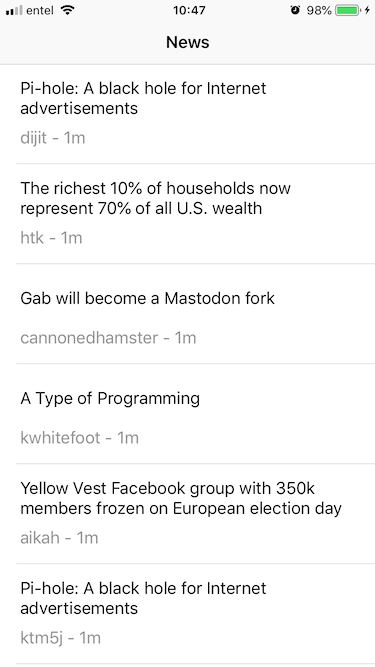
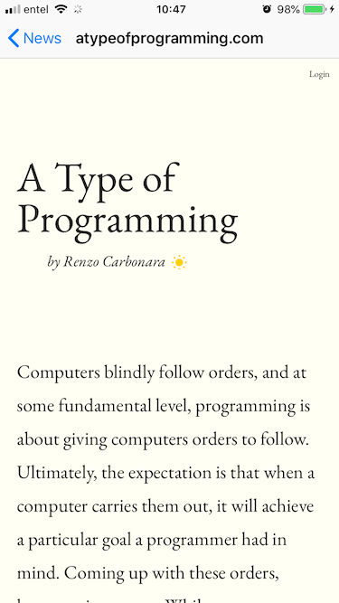

# HNMobileTest
News Feed (demo app)

[![Swift Version][swift-image]][swift-url]
[![License][license-image]][license-url]
  

Shows news feed with title (or short title), author and creation date. And shows web page related with news.
(no design was included in this app :S)

## Requirements

- iOS 11.1+
- Xcode 10.2.1
- Cocoapods 2.0
- Alamofire (5.0.0-beta.6)
- Reachability (3.2)
- iToast (0.0.1)

## Installation

1. Open a terminal in project root and install dependencies with 'pod install' command: 

2. Open generated file HNMobileTest.xcworkspace with Xcode

3. Run on simulator or device

## Meta

Diego Sepúlveda – [disepulv](https://github.com/disepulv/)

Distributed under the MIT license. See ``LICENSE`` for more information.

[https://github.com/disepulv/HNMobileTest](https://github.com/disepulv/HNMobileTest)

[swift-image]:https://img.shields.io/badge/swift-4.0-orange.svg
[swift-url]: https://swift.org/
[license-image]: https://img.shields.io/badge/License-MIT-blue.svg
[license-url]: LICENSE
